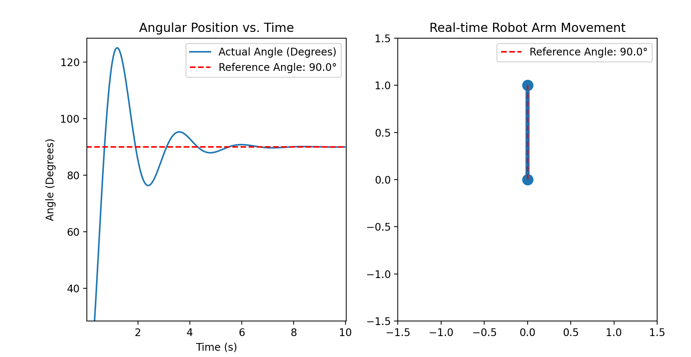

# Single Arm Robot Simulation

This repository contains a Python simulation of a single-arm robot, including real-time visualization of its movement as it attempts to reach a reference angle using a PD controller. The robot arm's dynamics are based on a second-order differential equation, and the simulation includes a time-domain plot comparing the actual angular position of the arm with the desired reference angle.



## Features
- **Real-time simulation**: The robot arm moves in real-time towards the reference angle.
- **PD control**: Proportional-Derivative (PD) controller adjusts the arm to reach the reference position.
- **Dynamic visualization**: Shows both the arm’s movement in 2D space and the comparison between the current and reference angle over time.
- **Visualization**: Plot of the robot arm’s angular position and its real-time movement in 2D space.

## Requirements
This project requires Python 3.x and the following Python packages:
- `numpy`
- `matplotlib`
- `scipy`

## Installation

### Option 1: Install dependencies manually
To install the necessary dependencies, you can run:

```bash
pip install numpy matplotlib scipy
